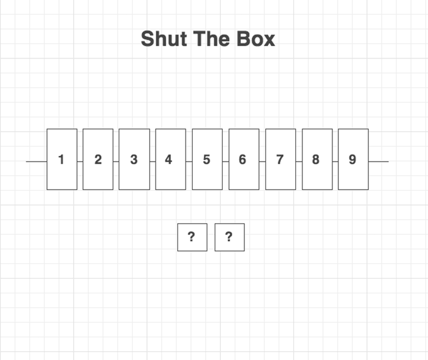

# Shut The Box

## Overview:
Shut the Box is a game that is based on chance.
Roll the dice, and flip the tiles that equal up to your dice total for that turn.
The lower your score, the better you did.
Flip all the tiles to win the game!

[http://khowen.github.io/shutTheBox/](http://khowen.github.io/shutTheBox/)

## Project Notes:
I chose to make this game because the logic involved for the tiles available to play versus the dice total made for a challenge.
In addition to some fun logic, I also experimented for the first time with making vector graphics(svg) in Adobe Illustrator.
I created this app to be fully responsive for all device sizes including mobile, and it is cross browser tested and compatible with modern browsers without the use of a framework or any libraries.
The only library in use is jQuery to speed development time.

## Technologies Used:
+ Languages - HTML5, CSS3, jQuery
+ Design - Adobe Illustrator, wireframe.cc, Google Fonts
+ Project Planning & User Stories - [Trello](https://trello.com/b/krONaPHr/shut-the-box)
+ Sublime Text 3

## Wireframe:

## Future Developments:
+ Animated reset for a new game.
+ Undo feature for a user who wants to redo a tile flip.
+ Scoreboard feature to store best all time games from all users.
